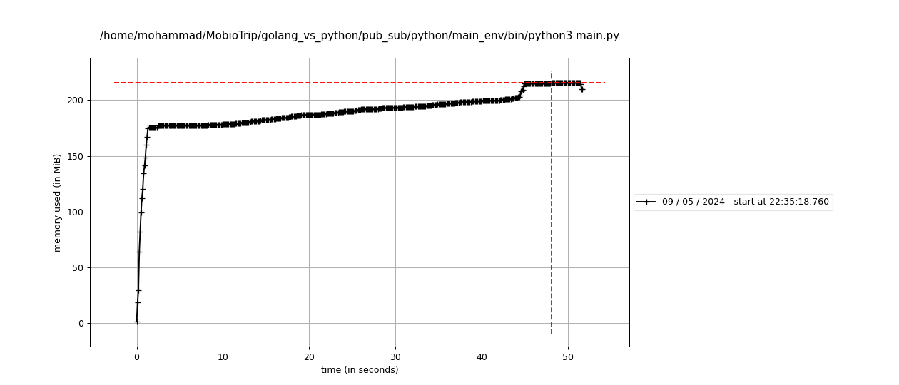
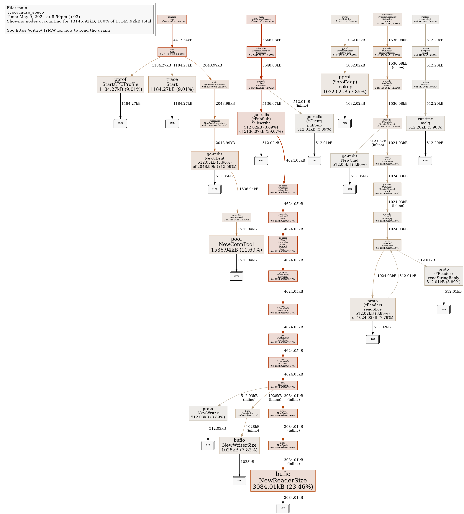
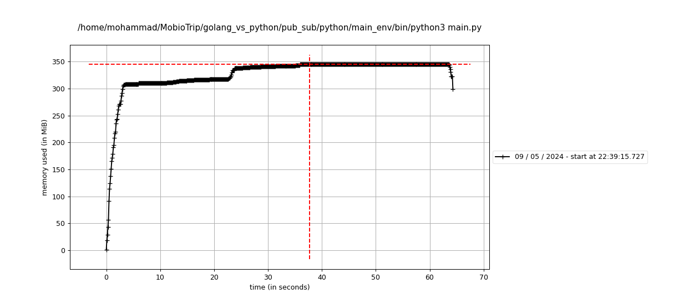
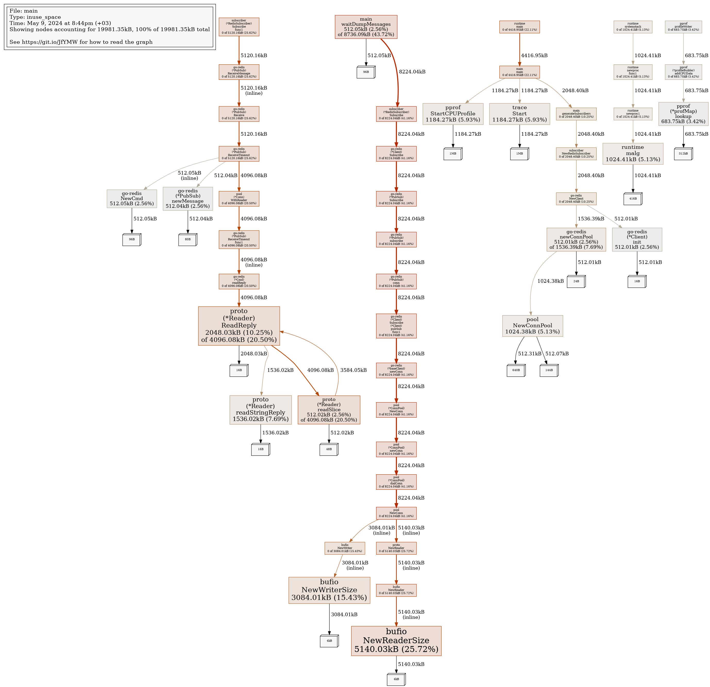

# Publish-Subscribe With Redis (Golang vs. Python)

In this repo, I am trying to build a pub-sub system using [**Redis**](https://redis.io/) (in-memory database), but with two different languages ([Golang](https://go.dev/) and [Python](https://www.python.org/)).

Previously, I built a pub-sub system using **Python** and **Redis**, but now I am learning Golang and I have discovered too many features with this language. So now I am trying to build the same system but with **Golang** as a main language.

**NOTE**: Before start reading, you should know that I am just a simple programmer who tries to learn something new every day, so I can be wrong.

## Comparison Idea

It's something like [stress testing](https://testsigma.com/blog/software-stress-testing/), but instead of trying to break down the system, I will assume a number of seconds to run the code (i.e. 10 seconds).

The thing that I will do is:

>running one thousand (1000) subscribers and one thousand (1000) publishers, each publisher has to publish one hundred (100) messages via a specific Redis channel, and finally see how much time and memory the process consumes.

## UPDATE: DOCKER COMPOSE 

**Docker** is a great technology, so instead of installing redis on your device directly, you can build a **redis-container** by this command

​​    > `docker-compose -f docker-compose-redis-only.yml`

## Golang

the **Redis** library that I am using is [go-redis](https://github.com/redis/go-redis), you can install it with the following command:

`go get github.com/redis/go-redis/v9`

to build the pub-sub system, I've completely used the channel system that is supported by Redis.

I will use the **go-routines** to build the whole system, each subscriber is a separate **go-routine**, same thing for publishers.

The tool that I am using for measuring memory consumption is **pprof** from go tools. all that you need to do is generate tracing files, and run the tool using the following command:

`go tool pprof <trace_file.out>`

## Python

Again, I will build the whole system using **the Redis Channels System**, but the difference here is that I will use `multiprocessing.pool.ThreadPool` because it's kind of complicated to manage many threads manually. I will create 5 threads for publishing messages, and 5 threads for getting the published messages.

> **TODO:** Try `ThreadPoolExecutor` instead of `ThreadPool`

For measuring memory consumption, I will use [`memory-profiler`](https://pypi.org/project/memory-profiler/) (a Python library).

To Install `memory-profiler`, use the following command:

> `pip install memory-profiler`

to generate a memory consumption report file, just run the
following command:

> `python -m memory_profiler your_script.py`

then you can read the file to see the memory consumption of your program.

## The Final Result

The following result is what I get by running this repo on my device:

* **OS** : Debian Gnu/Linux 11
* **CPU** : Core i7-4700MQ
* **RAM** : 8 GB

**The measurement method:**

It's so simple, I am just making the main thread sleeping for many seconds, while I am watching system monitor (like `top` in linux systems)

I know it's stupid, but it's the only way to avoid any overhead (like locking or waiting until all threads or routines have finished)

The results that I have get is:

### First Test Case
> Number of publishers = 500\
> Number of subscribers = 500\
> Messages per publisher = 100

### Python

* Time: 50-55 sec
* Memory Consumption: 250 MB

    

#### Golang

* Time: 20-25 sec
* Memory Consumption: 13 MB

    

**The Winner is:** Golang

### Second Test Case

> Number of publishers = 1000\
> Number of subscribers = 1000\
> Messages per publisher = 100

#### Python

* Time: 50 - 55 sec.
* Memory Consumption (using `memory-profiler`): 350 MB

    

#### Golang

* Time: 60 - 65 sec.

* Memory Consumption: 19.98135 MB

    

**The Winner is:** Python, but Golang also have tiny memory consumption comparing to Golang.

